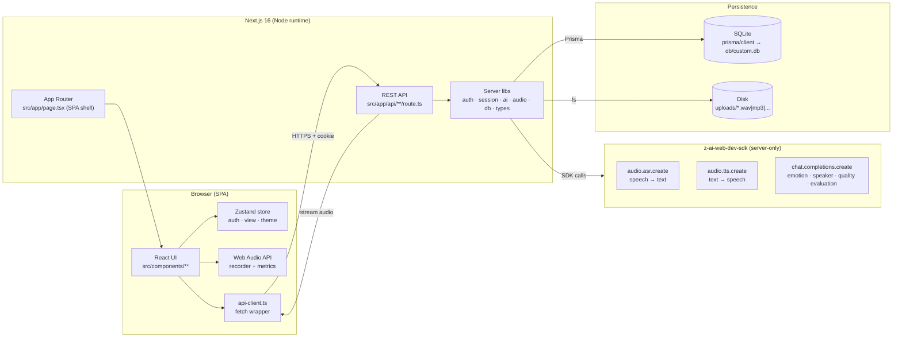
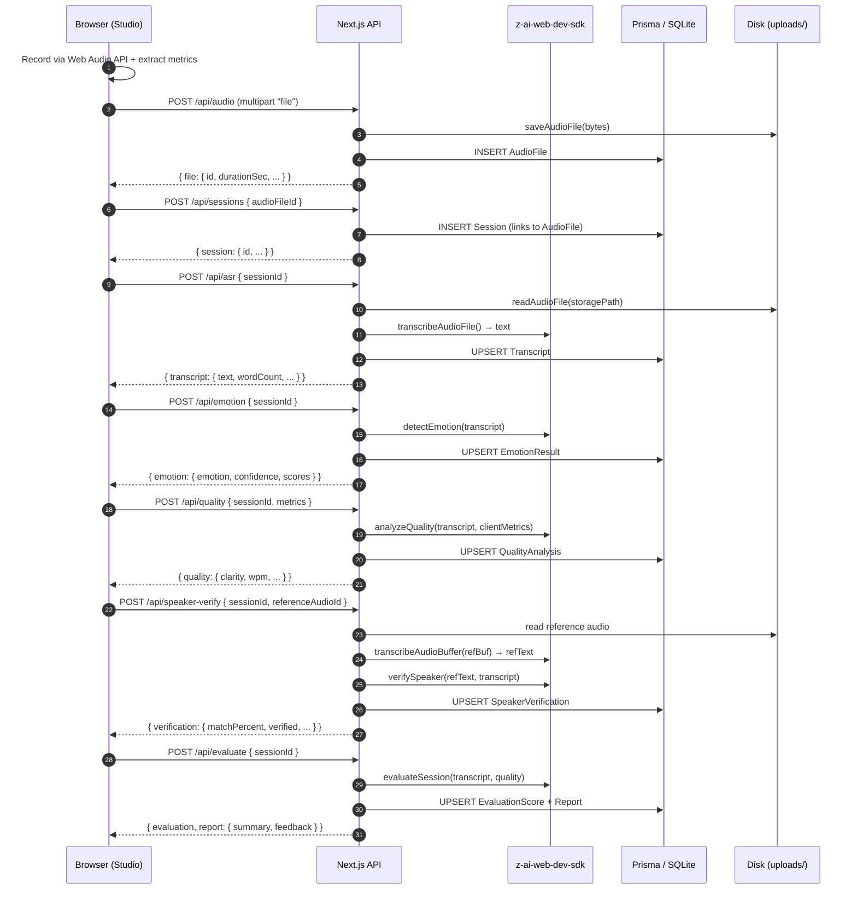

# Architecture — Voice-Based Connect

Voice-Based Connect is a single-page Next.js application that combines an in-browser recording studio, a server-side AI pipeline (speech-to-text, text-to-speech, and LLM-driven analyses), and an analytics dashboard — all backed by a small relational database and on-disk audio storage.

This document explains the layers of the system, the request flow for a full session, the authentication flow, the folder structure, and a step-by-step "how it works" sequence.

## High-Level Diagram



## Layers

### 1. Browser SPA

The whole authenticated product lives on the single route `/` (`src/app/page.tsx`). On mount it hydrates the auth state from `GET /api/auth/me` via the Zustand store (`src/lib/store.ts`):

- **Logged-out users** see the marketing **Landing page** (`src/components/landing/landing-page.tsx`) with the auth modal.
- **Logged-in users** see the **AppShell** (`src/components/app-shell.tsx`) which switches between views: Dashboard, Studio, TTS, History, Admin (role-gated), Settings.

The Studio view uses the **Web Audio API** to record audio in-browser, extract live metrics (RMS volume, noise floor, pitch via autocorrelation), and play back uploaded files.

### 2. REST API (Next.js Route Handlers)

All backend logic is exposed as Route Handlers under `src/app/api/**/route.ts`. Each handler:

1. Resolves the authenticated user via `requireUser()` / `requireAdmin()` (`src/lib/session.ts`), which reads the `vbc_session` httpOnly cookie and verifies the JWT (`src/lib/auth.ts`).
2. Validates input.
3. Talks to Prisma (`src/lib/db.ts`) and/or the AI services (`src/lib/ai.ts`) and/or disk audio storage (`src/lib/audio.ts`).
4. Returns JSON (or binary audio for the `/audio/[id]` and `/tts` endpoints).

### 3. AI service layer (`src/lib/ai.ts`)

A thin wrapper around `z-ai-web-dev-sdk` exposing:

- **ASR** — `transcribeAudioFile(path)` and `transcribeAudioBuffer(buffer)` → string
- **TTS** — `synthesizeSpeech(text, { voice, speed, format })` → Buffer (auto-chunks text >1000 chars)
- **LLM helpers** — `detectEmotion`, `verifySpeaker`, `analyzeQuality`, `evaluateSession` — each builds a strict-JSON prompt, calls `chat.completions.create` with `thinking: disabled`, parses the response leniently, and falls back to a deterministic default on any error.

> **The `z-ai-web-dev-sdk` MUST run on the server.** It is imported only from server modules (`src/lib/ai.ts`, route handlers). The client bundle never touches it.

### 4. Audio storage (`src/lib/audio.ts`)

Uploaded/recorded files are persisted on disk under `uploads/` at the project root. The library:

- Validates MIME types and extensions (WAV/MP3/M4A/AAC/OGG/WEBM).
- Generates a timestamped + UUID filename to avoid collisions.
- Reads / deletes files via `fs.promises`.
- Estimates WAV duration by parsing the RIFF header (scanning chunks for `data`).

### 5. Database (Prisma + SQLite)

`prisma/schema.prisma` defines 10 relational models (see [`ER_DIAGRAM.md`](./ER_DIAGRAM.md)). `src/lib/db.ts` instantiates a single `PrismaClient`. The schema is pushed to SQLite via `bun run db:push`.

## Request Flow — Full Session (Record → Transcribe → Analyze)



## Authentication Flow

```mermaid
sequenceDiagram
    autonumber
    participant U as Browser
    participant API as Next.js API
    participant DB as Prisma / SQLite

    Note over U,API: Registration
    U->>API: POST /api/auth/register { name, email, password }
    API->>DB: count Users — if 0, role = ADMIN else USER
    API->>DB: bcrypt hash + INSERT User
    API->>DB: INSERT LoginHistory (success=true)
    API->>API: jose SignJWT (HS256, 7d) → token
    API-->>U: Set-Cookie: vbc_session=<token>; HttpOnly; SameSite=Lax; (Secure in prod)

    Note over U,API: Subsequent requests
    U->>API: GET /api/auth/me (cookie)
    API->>API: jwtVerify(token) → { sub, email, role, name }
    API->>DB: findUnique User by sub
    API-->>U: SafeUser JSON

    Note over U,API: Logout
    U->>API: POST /api/auth/logout
    API-->>U: Set-Cookie: vbc_session=; Max-Age=0
```

### Key security details

- **Passwords** are hashed with `bcryptjs` (salt rounds = 10).
- **Sessions** are signed JWTs (HS256, 7-day TTL) carried in an `HttpOnly`, `SameSite=Lax` cookie named `vbc_session`. The `Secure` flag is added when `NODE_ENV=production`.
- **First signup becomes admin.** Every subsequent signup is a regular `USER`. Only `ADMIN` users may access `/api/admin/*`.
- **Forgot/reset password**: `POST /api/auth/forgot-password` returns a 1-hour reset JWT (in this sandbox the token is returned in the JSON response for convenience; production deployments should email it). `POST /api/auth/reset-password` verifies the token and the stored `resetToken` hash before re-hashing the new password.
- **Login audit**: every login attempt (success or failure) is written to `LoginHistory` with IP and user-agent.
- **Tenant isolation**: all user-facing routes scope queries by `userId` from the JWT — a user can never read or delete another user's audio, sessions, or analyses.

## Folder Structure

```
my-project/
├── prisma/
│   └── schema.prisma                # 10-model relational schema
├── db/
│   └── custom.db                    # SQLite database file (generated)
├── uploads/                         # Disk storage for audio artifacts
├── public/                          # Static assets (logo.svg, robots.txt)
├── docs/                            # ← you are here
│   ├── ARCHITECTURE.md
│   ├── API.md
│   ├── DEPLOYMENT.md
│   └── ER_DIAGRAM.md
├── src/
│   ├── app/
│   │   ├── layout.tsx               # Root layout, theme-flash script, Sonner toaster
│   │   ├── page.tsx                 # SPA shell — hydrates auth, routes Landing vs AppShell
│   │   ├── globals.css              # Tailwind + theme tokens
│   │   └── api/                     # REST Route Handlers (see API.md)
│   │       ├── route.ts
│   │       ├── auth/{register,login,logout,me,forgot-password,reset-password}/route.ts
│   │       ├── audio/route.ts, audio/[id]/route.ts
│   │       ├── sessions/route.ts, sessions/[id]/route.ts
│   │       ├── asr/route.ts
│   │       ├── tts/route.ts
│   │       ├── emotion/route.ts
│   │       ├── quality/route.ts
│   │       ├── speaker-verify/route.ts
│   │       ├── evaluate/route.ts
│   │       ├── dashboard/route.ts
│   │       ├── export/route.ts
│   │       └── admin/{users,users/[id],stats}/route.ts
│   ├── components/
│   │   ├── app-shell.tsx            # Sidebar + topbar + view switcher
│   │   ├── auth/auth-modal.tsx      # Login / signup / forgot / reset
│   │   ├── landing/landing-page.tsx # Marketing page
│   │   ├── shared/                  # Brand, theme toggle, loaders, score display
│   │   ├── ui/                      # shadcn/ui primitives (button, card, dialog, ...)
│   │   └── views/                   # dashboard, studio, tts, history, admin, settings
│   ├── hooks/                       # use-audio-recorder, use-mobile, use-toast
│   └── lib/
│       ├── ai.ts                    # z-ai-web-dev-sdk wrapper (ASR/TTS/LLM)
│       ├── audio.ts                 # disk audio storage + WAV duration
│       ├── auth.ts                  # bcrypt + jose JWT helpers
│       ├── api-client.ts            # client-side fetch wrapper
│       ├── db.ts                    # PrismaClient singleton
│       ├── session.ts               # requireUser / requireAdmin / errorResponse
│       ├── store.ts                 # Zustand store (auth · view · theme)
│       ├── tts-voices.ts            # client-safe voice list
│       ├── types.ts                 # shared TS types matching API shapes
│       └── utils.ts                 # cn() helper
├── package.json
├── next.config.ts
├── tailwind.config.ts
├── tsconfig.json
├── eslint.config.mjs
├── components.json                  # shadcn/ui config
├── .env                             # local secrets (not committed)
├── .env.example                     # template
├── database.sql                     # raw SQL DDL equivalent to schema.prisma
└── worklog.md                       # build log
```

## How It Works — Record → Transcribe → Analyze

1. **Record.** The Studio view (`src/components/views/studio-view.tsx`) uses the `use-audio-recorder` hook (Web Audio API) to capture the microphone, compute live RMS volume, estimate background noise from silence gaps, and run an autocorrelation pitch detector. The recorded blob is encoded as a WAV and uploaded.

2. **Upload.** `POST /api/audio` receives the multipart file, validates its MIME type against an allow-list, caps at 25 MB, writes the bytes to `uploads/<timestamp>-<uuid>.<ext>` via `saveAudioFile()`, parses the WAV header for duration, and inserts an `AudioFile` row. The file id is returned to the client.

3. **Create session.** `POST /api/sessions` links the audio to a new `Session` row owned by the current user, copying the audio duration as the session duration.

4. **Transcribe.** `POST /api/asr` reads the audio from disk, calls `transcribeAudioFile()`, which base64-encodes the bytes and submits them to `zai.audio.asr.create`. The returned text is upserted into the `Transcript` table; word and char counts are derived server-side.

5. **Analyze.** Three independent LLM analyses are triggered in sequence (or in any order) by the Studio UI:
   - **Emotion** (`POST /api/emotion`) — classifies the transcript into one of six emotions with per-class probability scores (JSON).
   - **Quality** (`POST /api/quality`) — combines client-side audio metrics (volume, noise, pitch, duration) with the transcript to derive clarity, fluency, grammar, vocabulary, confidence and pronunciation scores.
   - **Speaker verification** (`POST /api/speaker-verify`) — transcribes a reference audio file and compares its wording, phrasing style and vocabulary with the session transcript to estimate a speaker-match percentage.

6. **Evaluate.** `POST /api/evaluate` calls `evaluateSession()` — a single LLM call that takes the transcript plus all quality scores and returns both an `EvaluationScore` (6 sub-scores + `overallInterview` + `overallSpeaking` + `rating`) and a `Report` (a 2-3 sentence summary plus structured feedback: strengths, weaknesses, improvement tips, recommended practice, pronunciation/vocabulary/grammar suggestions).

7. **Visualize.** The Studio renders the results immediately (pie chart for emotion, bars for quality and evaluation, ring for overall score, structured feedback list). The data is also persisted so the **Dashboard** (aggregate trends), **History** (searchable list), CSV export, and Admin views can read it later without re-running the AI.

8. **Export.** `GET /api/export?format=csv` streams the user's sessions as a CSV with all scores + transcript. PDF export is implemented client-side by opening a generated report window and triggering the browser's print-to-PDF dialog.
